 Platforms where people share original creative work — writing, music, art — are facing a new challenge: how do you know whether what someone posted was made by them, or generated by AI and passed off as human? Not to police creativity, but to protect attribution, build trust, and give audiences the context they actually need.

 In this project, you'll build Provenance Guard: a backend system that any creative sharing platform could plug into to classify submitted content, score confidence in that classification, surface a transparency label to users, and handle appeals from creators who believe they've been misclassified.

Main Goals: 
1. Design and implement a multi-signal AI content classification pipeline.
2. Build confidence scoring that communicates uncertainty rather than forcing binary outputs.
3. Create end-user transparency labels that surface AI verdicts clearly and fairly.
4. Implement an appeals workflow for contested classifications.
5. Add production safety infrastructure: rate limiting and structured audit logging.

FEATURES: 
1. Content Submission Endpoint: Build an API endpoint that accepts a piece of text-based content (a poem, a short story excerpt, a blog post) for attribution analysis. The endpoint must return a structured response including the attribution result, confidence score, and the transparency label text that would be shown to the user.

2. Multi-Signal Detection Pipeline: Your detection pipeline must use at least 2 distinct signals to classify content. Single-signal detection is not acceptable. Your planning.md and README must explain what each signal captures and why you chose them.

3. Confidence Scoring with Uncertainty: Your system must return a confidence score, not just a binary label. The score should reflect genuine uncertainty — a 0.51 confidence should produce a meaningfully different transparency label than a 0.95. Your README must explain how you approached this and how you tested whether your scores are meaningful.


4. Transparency Label: Design and implement the label that would be displayed to a reader on the platform. It must communicate the attribution result in plain language and make the confidence level meaningful to a non-technical reader. Include a typed description of all three label variants (high-confidence AI, high-confidence human, uncertain) in your README — write out the exact text each one displays. You're welcome to include a screenshot or mockup as well, but the written description is what's required.


5. Appeals Workflow: Implement a mechanism for creators to contest a classification. At minimum, an appeal must: capture the creator's reasoning, log the appeal alongside the original decision, and update the content's status to "under review." Automated re-classification is not required.


6. Rate Limiting: Implement rate limiting on your submission endpoint. Your README must document the limits you chose and your reasoning for those specific values.


7. Audit Log: Every attribution decision — including confidence score, signals used, and any appeals — must be captured in a structured audit log. Document the log in your README (or via the GET /log output) with at least 3 entries visible.


User Submission -> Groq analysis -> Returns a confidence score, attribute result and transparency label that a user examins.

---

# Architecture

## System Overview

A submitted piece of text takes the following path from start to finish:

1. **Creator** sends raw text to **`POST /submit`**.
2. The endpoint runs **Signal 1 (Sentence-Length Burstiness)** locally — a fast, no-cost statistical pass.
3. It then runs **Signal 2 (Groq Hedging/Specificity)** — a semantic pass via the Groq LLM.
4. **Confidence Scoring** combines the two signal scores into a single human-confidence value and a label (`human` / `ai` / `uncertain`).
5. The **Transparency Label Generator** turns that verdict into plain-language text for the reader.
6. The full decision — label text, confidence, and per-signal detail — is written to the **Audit Log**.
7. The **Response Builder** returns `id`, `attribution`, `human_confidence`, and `transparency_label` to the creator.

If a creator disputes the verdict, they call **`POST /appeal/{id}`** with their reasoning; the system marks the content `under_review`, appends the appeal *alongside* the original decision in the audit log, and acknowledges receipt. No automated re-classification — a human reviewer assesses.

## The Two Detection Signals

The pipeline uses two deliberately **heterogeneous** signals so their blind spots only partially overlap. Signal 2 can catch a rhythm-varied AI text that fools Signal 1, and Signal 1 still works when Signal 2 is rate-limited or down.

### Signal 1 — Sentence-Length Burstiness (statistical, local, no API cost)

- **What property it measures:** the burstiness coefficient `B = (σ − μ) / (σ + μ)` of per-sentence word counts, normalized to `[0,1]` (where 1 = human-like). σ is the standard deviation and μ the mean of sentence lengths.
- **Why that property differs between human and AI writing:** RLHF training rewarded smooth, readable prose, so LLMs converge on a narrow "comfortable" sentence-length range and rarely jolt between very short and very long sentences. Humans vary pace deliberately for rhetorical effect — short punches set against long, subordinate-clause-laden constructions — producing high burstiness.
- **What it can't capture (blind spot):** genre dominates the signal. AP-style journalism, legal, and scientific writing are institutionally uniform and score AI-like even when human. Minimalists (Hemingway, Carver) also score AI-like. It is unreliable below ~6 sentences. And it is purely formal with zero semantic awareness, so an AI prompted to "vary your sentence rhythm" defeats it entirely.

### Signal 2 — Groq LLM: Hedging Density + Specificity Ratio (semantic, API-backed)

- **What property it measures:** two sub-scores from a structured Groq prompt — (1) **hedging density**, the frequency of epistemic hedges and generic transitions ("it is worth noting", "furthermore", "in many ways"); and (2) **specificity ratio**, the proportion of concrete, personal, verifiable detail versus abstract generalization. These combine into a human-likeness score where low hedging + high specificity = human-like.
- **Why that property differs between human and AI writing:** RLHF penalized overconfident wrong answers, so LLMs hedge by default. They also default to abstraction because genuine specificity requires lived experience — a model writes "the aroma of freshly brewed coffee," whereas a human writes "the radiator clicked exactly twice before the heat came on."
- **What it can't capture (blind spot):** academic and professional writing requires hedging by convention, so those human authors get flagged AI-like. Web and blog prose mirrors LLM transition conventions because they share a training source. There is a **circularity risk** — an LLM judging LLM-ness may detect its own model family more reliably than others. Lyric poetry and aphorism are structurally low-specificity, so that human work is flagged AI-like. Short texts inflate the judge's hallucination rate.

## Request Flow Diagram

```mermaid
flowchart TD
    subgraph SUBMISSION["Submission Flow"]
        C1([Creator]) -->|"raw text — JSON {text}"| EP1["POST /submit"]
        EP1 -->|"raw text"| S1["Signal 1: Sentence Burstiness (local)"]
        S1 -->|"raw text + burstiness score 0–1"| S2["Signal 2: Groq Hedging / Specificity"]
        S2 -->|"both signal scores"| CS["Confidence Scoring (weighted combine)"]
        CS -->|"combined human-confidence + label (human / ai / uncertain)"| TL["Transparency Label Generator"]
        TL -->|"decision record: label text + confidence + per-signal detail"| AL[("Audit Log")]
        AL -->|"stored-entry confirmation + content_id"| R1["Response Builder"]
        R1 -->|"id, attribution, confidence, label text"| C1
    end

    subgraph APPEAL["Appeal Flow"]
        C2([Creator]) -->|"content_id + reasoning — JSON"| EP2["POST /appeal/{id}"]
        EP2 -->|"appeal reasoning; mark status = under_review"| SU["Status Update (lookup original decision)"]
        SU -->|"appeal entry + status change appended to original record"| AL2[("Audit Log")]
        AL2 -->|"updated-record confirmation"| R2["Response Builder"]
        R2 -->|"status: under_review + acknowledgement message"| C2
    end
```



## Confidence Thresholds (creator-protective, asymmetric)

```
score < 0.30   -> ai         (strong evidence required to accuse)
0.30 – 0.55    -> uncertain  (wide band; protects attribution)
score > 0.55   -> human
```

**Rationale:** a false "AI" label damages a real creator's attribution and reputation, whereas a false "human" pass is comparatively low-harm. The asymmetry encodes that the cost of the two error types is not equal — we require stronger evidence to brand work as AI than to clear it as human.

## False-Positive Trace

**Scenario:** A PhD student submits a polished dissertation paragraph — uniform academic sentence length, heavy scholarly hedging ("it may be argued that…", "the evidence broadly suggests…"). Both signals' blind spots fire in the same direction, *against* the human author.

1. **Signal 1** sees low burstiness (academic uniformity) → human-score ≈ **0.30**.
2. **Signal 2** sees high hedging plus moderately abstract specificity → human-score ≈ **0.35**.
3. **Confidence scoring** combines them (0.4·0.30 + 0.6·0.35) ≈ **0.33**. Under the asymmetric thresholds, 0.33 is *above* the 0.30 AI cutoff, so it lands in the **uncertain band**, and the label is **"uncertain," not "ai."** This is exactly why the band is wide and creator-protective: borderline evidence against the human is *not* strong enough to publicly brand real work as AI.
4. **Transparency label** therefore renders the *uncertain* variant — "we could not determine with confidence… human-authorship score 33%" — communicating doubt rather than an accusation. Confidence is always surfaced as a percentage, never as certainty.
5. **Appeal:** the creator contests via `POST /appeal/{id}` with reasoning ("this is my dissertation chapter; here is my draft history"). Status flips to **under_review**, the appeal is logged *alongside* the original decision (never overwriting it), and a human reviewer assesses.

**What this scenario dictates for implementation (Milestone 2):**
- The **uncertain band must be wide and asymmetric** so genre-driven false positives degrade to "uncertain," not "ai."
- **Labels must express confidence as a percentage**, and the uncertain variant must read as humility, not a verdict.
- **Appeals must be a single step and must preserve the original decision** in the audit log for the reviewer's context.

## API Endpoints

| Method & path | Purpose | Returns |
|---|---|---|
| `POST /submit` | Classify a submitted text | `id`, `attribution`, `human_confidence`, `transparency_label` |
| `POST /appeal/{id}` | Contest a classification; sets status `under_review` | `status`, acknowledgement message |
| `GET /log` | Structured audit log (≥3 entries) | array of decision + appeal records |